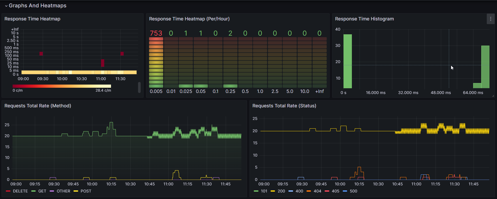

# NGINX PROMETHEUS EXPORTER
[](https://github.com/JustinMorritt/rust-nginx-prometheus-exporter/actions/workflows/rust.yml)
[](https://github.com/JustinMorritt/rust-nginx-prometheus-exporter/actions/workflows/Release.yml)

## Guide
1. Have a server setup using prometheus to scrape from this exporter
2. Edit your nginx config file adding in the **Required** log format
`sudo vim /etc/nginx/nginx.conf`
```conf
log_format logger-json escape=json '{"source": "nginx", "time": $msec, "resp_body_size": $body_bytes_sent, "host": "$http_host", "address": "$remote_addr", "request_length": $request_length, "method": "$request_method", "uri": "$request_uri", "status": $status,  "user_agent": "$http_user_agent", "resp_time": $request_time, "upstream_addr": "$upstream_addr"}';

access_log /var/log/nginx/access.log logger-json;
```
3. Add your executable to the /bin/
`sudo cp rust-nginx-exporter /usr/local/bin/`
4. Create a systemd service
`sudo vim /etc/systemd/system/rust-nginx-exporter.service`
```conf
[Unit]
Description=Nginx Exporter Service
After=network.target
[Service]
User=root
Group=root
Type=simple
ExecStart=/usr/local/bin/rust-nginx-exporter
[Install]
WantedBy=multi-user.target
```
Note - Additional arguments can be passed in at the ExecStart for more customization


5. Run the service and enable it within systemctl
```terminal
   sudo systemctl daemon-reload
   sudo systemctl enable rust-nginx-exporter
   sudo systemctl start rust-nginx-exporter
   sudo systemctl status rust-nginx-exporter
```
6. Check your service locally with `curl localhost:9200/metrics` or whatever your path is
7. Add in the target to your Prometheus target:
`sudo vim /etc/prometheus/prometheus.yml`
```yaml
scrape_configs:
  - job_name: 'nginx_exporter'
    static_configs:
      - targets: ['534.15.2.23:9200']
```

# Grafana Visualization
- Export of the dashboard can be found [Here](./grafana/RustNginxLogStatsGrafana.json)

